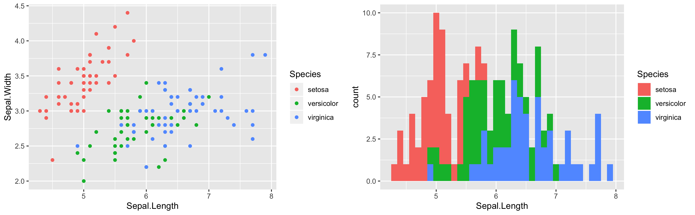

```{r setup, include=FALSE}
knitr::opts_chunk$set(echo = TRUE)
```

To Do:

[Currently Incomplete]

* Consider PDF and CDF discussion
* Define statistical topics e.g. Mean, Variance, Standard Deviation, Quantiles. (Consider linking to different page?)
* FORMATTING AND CLARITY

## The IRIS dataset
Hello World!

I am far from being experienced in data science, therefore I should start with one of the most common datasets in the world; the **IRIS** dataset.

This dataset is was commonly referred to in throughout my university courses as a means to introduce various machine learning/statistical concepts. 

Fortunately this dataset is already built into R, which makes it a suitable candidate for a beginner Exploratory Data Analysis (EDA). 

The dataset describes three classes of flowers:

 * **Setosa**
 * **Versicolor**
 * **Virginica**

The features used to describe these flowers are: 

* Sepal Length
* Sepal Width
* Petal Length
* Petal Width

Each flower has their own unique Sepal lengths/widths and Petal lengths/widths.

### Assignment objects

The first line of code will assign the iris dataset to an object called "iris_data". This will allow for more functions to be applied to the object at a later stage of this EDA. 
```{r load data}
iris_data <- iris
```


### Preview the dataset
The `head()` function will display the first 5 rows of the dataset. 

```{r head_iris}
head(iris_data)
```

The `dim()` function wil describe the dimensions of the iris dataset (or "iris_data" object). The function shows that there are 150 rows of data with 5 headings. 

```{r dim}
dim(iris_data)
```

Referring to the previous `head()` function, we can see that the 5 headings are: 

 * Sepal.Length
 * Sepal.Width
 * Petal.Length
 * Petal.Width
 * Species

The `summary()` function allows us to see summary statistics of the dataset. 

```{r summary_iris}
summary(iris_data)
```

Interestingly enough, it also shows the unique values of each flower, and their occurences in the dataset which is seeen in the "species" column.

A useful function to see the **type** of data in the dataset is `sapply()`.
e.g. `sapply(data, typeof)`

```{r sapply}
sapply(iris_data, typeof)
```

This shows that all the data in this dataset are of type **double**, with the exception of species which is **integer**.

My understanding is that in the *real world*, datasets are not always going to be clean, and some entries may have null or incorrect values. 
The`*is.null()` function can be used to check if the object contains null values. 

If the output is `TRUE`, then our dataset does contain NULL values, and therefore we can either choose to omit them from our analysis or do something else. However, if the output is `FALSE`, then our dataset *DOES NOT* contain null values (**which is a good thing!**). 

```{r}
is.null(iris_data)

```

There is also the `skim()` function, found in the **skimr package** that will scan your entire dataset and summarise, check for null values and more!
```{r message = FALSE, warning = FALSE}
#install.packages("skimr)
library(skimr)
skim(iris_data)
```


Suggested by Indrajeet Patil, who also created **ggstatsplot2**, you can visualise your dataset as well as display missing data by using the `vis_miss()` function, and `vis_dat()` function by utilizing the visdat library.
```{r, warning=FALSE, message = FALSE}
#install.packages("devtools")
library(devtools)
#devtools::install_github("ropensci/visdat")
library(visdat)
vis_miss(iris_data)
```
This output shows that there are **no missing entries** in the dataset. This visualisation should look a little different as we explore more unstructured/semi-structured datasets later on.
```{r}
vis_dat(iris_data)
```

This `vis_dat()` output shows you a ggplot object of what is inside the dataframe. Cells are colored according to what class they are and whether the values are missing. Being a ggplot object, you can customise the plot and/or change the labels if needed. 

## Conclusion
There is no missing data, or NULL entries in this dataset as shown in the methods utilized above. 

## Visualisations

Now that we've checked to make sure that the dataset is cleaned and ready to use, lets do some visualisations.

Scatterplots are a great way to determine if there is a linear correlation between different variables in your dataset. 

By using the `pairs()` function from the ggplot package, we are able to create a scatterplot matrix.

```{r scatterplot}
#install.packages("ggplot2")
#library(ggplot2)
pairs(~Sepal.Length+Sepal.Width+Petal.Length+Sepal.Width,data=iris_data, main="Iris Scatterplot Matrix")
```
### Conclusion
The scatterplot matrix shows that the Sepal Length and Petal Length are highly correlated. In other words, if the Sepal Length of the flower is long, the petal length is expected to be long as well and vice versa. We also see that there is some positive correlation between *Petal Length* and *Sepal Length*. However it is not as strong as the Sepal Length and Petal Length correlation. 

### Histograms
```{r hist_SepalLength, warning=FALSE, message = FALSE}
library(ggplot2)
ggplot(iris_data, aes(x=Sepal.Length, fill=Species)) + geom_histogram(binwidth = 0.1)
```

This histogram shows the Sepal length of all the different species of flowers in the dataset. The different colors represent the different species. Using the Sepal length as a feature, we have an easier time identifying a Setosa flower, as it has the shortest average length. However, it is more difficult to identify a Versicolor and/or Virginica Flower as the lengths are not easily distinguished. 

The histogram is also a visual representation of the distribution of numerical data. Creating a histogram for *discrete* data simple as you just add the value to the plot. However for *continuous* data, you need to **bin** (divide the range of values into a select number of intervals and count how many values fall into each interval) the data. **note: binning this data is NOT shown here**


### 2D Scatterplot for Sepal Length and Sepal Width
```{r}
qplot(Sepal.Length, Sepal.Width, data=iris_data, colour = Species)
```

* Setosa points (RED) can be distinguished from other species by using sepal length and sepal width as features.

* Versicolor (GREEN) and Virginica (BLUE) cannot be easily distinguished as there is considerable overlap between the points.

The scatterplot produced here also reflects the visualisation presented by the histogram. However I find that the scatterplot is much easier to understand compared to the histogram. The points are isolated and there is little overlap between them. This makes it easier to distinguish different points. The colors also help visually identify the class that each point belongs to. 

This concept could also translate to machine learning via feature selection. Selecting the best features for an algorithm, in order to best identify the type of flower. 

## Histogram vs Scatterplot

One of the challenges when it comes to visualising data, is selecting the right plot to present. Each plot has it's own advantages and disadvantages and therefore it is crucial to select the right one to tell your story. 

```{r, warning=FALSE, message=FALSE}
#Histogram v Scatterplot
#install.packages("cowplot")
library(cowplot)
scatter_sep<- ggplot2::qplot(Sepal.Length, Sepal.Width, data=iris_data, colour = Species)
hist_sep <- ggplot2::ggplot(iris, aes(x=Sepal.Length, fill=Species)) + geom_histogram(binwidth = 0.1)
p <- plot_grid(scatter_sep, hist_sep)
save_plot("sepal scat v hist.png", p, ncol = 2)
```


**Histograms** should be used to *display the frequency of occuring data* and the histogram often uses only *one feature (found on the y-axis)*. The histogram is also used to show the distribution of data. As we can see here, the distribution is similar to a Gaussian curve.  

On the other hand the **2D-scatterplot** should be used to *show the relationship between two features* of your data. In this example, if we want to identify the characteristics of a Setosa flower, we know that it has high Sepal width, but short Sepal length. 

### Conclusion
Depending on the requirements of your analysis, selecting the correct graph is crucial to presenting your data. Each graph has it's own place and purpose. Choose wisely.

## Drawing insights
Although this all seems very obvious initially, we are able to draw insights from this data. For example, the Setosa flower has the smallest sepal Length, petal width and petal length, but **highest Sepal width**. Without an image as reference, and no prior knowledge about flowers, this data helps us to create an image where the Setosa flower species has small petals but a wide sepal. 


Based on previous predictions using the data from the scatterplot. We are correct. The petals appear to be very small, and the sepals appear to be somewhat short compared to the Virginica flower and the Versicolor flower, but the sepals are the wide and short. This image backs up our prediction based on the visualised data plots. 


## PDF PMF and CDF Discussion

As this is my attempt at Exploratory Data Anlaysis (EDA) I should discuss some analysis techniques. A few commonly used techniques include Proability Distribution Function (PDF) and Cumulative Distribution Function (CDF). Before these techniques can be discussed, a few key concepts need to be covered. 

### Random Variables

A random variable is the quantifiable outcome of a random process.  An example of this would be a coin toss. When you toss a coin, the outcome can either be **heads** or **tails**. However, you can define these outcomes as either 1 or 0. 1 for heads, and 0 for tails. You can also apply this concept to another random process such as rolling a die. You can quantify the outcome by the face that you land on after the die roll, such as 1,2,3,4,5 or 6. Random variables are often denoted by a captial letter (e.g. $X$ = 1).

There are two types of random variables, both of which will be discussed below.

#### Discrete Random Variable
A discrete random variable is a variable that can take a finite number of values or values within a certain range. In other words, discrete random variables are **countable** values. An example are the number of students currently in class. You might say, *"there were 15 students that turned up to class today"*. However, the number of students cannot go into decimal places (e.g. 15.5 students), as you can't have half a student. The reason I use this example, at least in my experience, the number of students that *actually* turn up to class is quite random. Therefore the outcome is the probability of obtaining a specific value.

$$p(x) = P(X) = 15$$ 
You can read this as *the probability of $x$ is equal to the probability that $X$ is* **equal to** *15*

#### Continuous Random Variable
A continuous random variable is a variable that could take the form of any infinitely small or large number. There are no "gaps" between potential outcomes. An example of a continuous random variable is weight. If say you worked at a donut processing factory and the weight of the donut coming off the process line could range anywhere between 19.8 grams and 20 grams. One item could be 19.89 grams, or 19.942 grams and so on, depending on how much detail you need. 

### Probability Mass Function
The probability mass function (PMF) is a statistical term that describes the probability distribution of a **discrete random variable**. 

### Probability Density Function


### Cumulative Distribution Function
References:

* [Flower image reference: http://suruchifialoke.com/2016-10-13-machine-learning-tutorial-iris-classification/]
* https://www.r-bloggers.com/scatterplot-matrices/
* https://www.littlemissdata.com/blog/simple-eda
* https://medium.com/@rishav.jnit/exploratory-data-analysis-eda-on-iris-dataset-using-python-cadd850c1fc6
