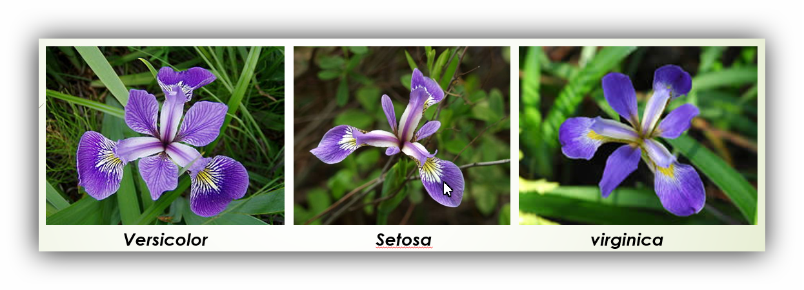

```{r setup, include=FALSE}
knitr::opts_chunk$set(echo = TRUE)
```

## The beginning
Hello World!

I am far from being experienced in data science, therefore I figured I should start with one of the most common datasets in the world; the *IRIS* dataset.

This dataset is was commonly referred to in throughout my university courses as a means to introduce various machine learning/statistical concepts. 

Fortunately this dataset is already built into R, which makes it a suitable candidate for a beginner Exploratory Data Analysis (EDA). 

The dataset describes three classes of flowers:

 * Setosa
 * Versicolor
 * Virginica

As well as their sepal length/width and petal length/width. 

The first line of code will assign the iris dataset to an object called "iris_data". This will allow for more functions to be applied to the object at a later stage of this EDA. 

The head() function will display the first 5 rows of the dataset. 

The dim() function wil describe the dimensions of the iris dataset (or "iris_data" object). The function shows that there are 150 rows of data with 5 headings. 

```{r head_iris}
iris_data <- iris
head(iris_data)
```

```{r}
dim(iris_data)
```

By referring to the previous head() function, we can see that the 5 headings are: 
 * Sepal.Length
 * Sepal.Width
 * Petal.Length
 * Petal.Width
 * Species

The summary() function allows us to see summary statistics of the dataset. 
```{r summary_iris}
summary(iris_data)
```

Interestingly enough, it also shows the unique values of each flower, and their occurences in the dataset which is seeen in the "species" column.


A useful function to see the *type* of data in the dataset is sapply().
e.g. sapply(data, typeof)

```{r}
sapply(iris_data, typeof)
```

This shows that all the data in this dataset are of type *double*, with the exception of species which is *integer*.

My understanding is that in the *real world*, datasets are not always going to be clean, and some entries may have null values. 
The *is.null* function can be used to check if the object contains null values. 

If the output is *TRUE*, then our dataset does contain NULL values, and therefore we can either choose to omit them from our analysis or do something else. However, if the output is *FALSE*, then our dataset *DOES NOT* contain null values (which is a good thing!). 

```{r}
is.null(iris_data)

```

There is also the skim function, found in the *skimr package* that will scan your entire dataset and summarise, check for null values and more!
```{r}
#install.packages("skimr)
library(skimr)
skim(iris_data)
```


Suggested by Indrajeet Patil, who also created ggstatsplot2, you can visualise your dataset as well as display missing data by using the vis_miss() function, and vis_dat() function by utilizing the visdat library.
```{r}
#install.packages("devtools")
library(devtools)
#devtools::install_github("ropensci/visdat")
library(visdat)
vis_miss(iris_data)
```
This output shows that there are no missing entries in the dataset. This visualisation should look a little different as we explore more unstructured/semi-structured datasets.
```{r}
vis_dat(iris_data)
```

This vis_dat  output shows you a ggplot object of what is inside the dataframe. Cells are colored according to what class they are and whether the values are missing. Being a ggplot object, you can customise the plot and/or change the labels if needed. 

## Conclusion
There is no missing data, or NULL entries in this dataset as shown in the methods utilized above. 


Now that we've checked to make sure that the dataset is cleaned and ready to use, lets do some visualisations.

Scatterplots are a great way to determine if there is a linear correlation between different variables in your dataset. 

By using the pairs() function from the ggplot package, we are able to create a scatterplot matrix.

```{r scatterplot}
#install.packages("ggplot2")
#library(ggplot2)
pairs(~Sepal.Length+Sepal.Width+Petal.Length+Sepal.Width,data=iris_data, main="Iris Scatterplot Matrix")
```
## Conclusion
The scatterplot matrix shows that the Sepal Length and Petal Length are highly correlated. In other words, if the Sepal Length of the flower is long, the petal length is expected to be long as well and vice versa. 


```{r hist_SepalLength}
library(ggplot2)
ggplot(iris_data, aes(x=Sepal.Length, fill=Species)) + geom_histogram(binwidth = 0.1)
```

This histogram shows the Sepal length of all the different species of flowers in the dataset. The different colors represent the different species. This makes it easier to identify the differences in length between the different species. Using the Sepal length as a feature, we have an easier time identifying a Setosa flower, as it has the shortest average length. However, it is more difficult to identify a Versicolor and/or Virginica Flower as the lengths are not easily distinguished. 

```{r}
qplot(Sepal.Length, Sepal.Width, data=iris_data, colour = Species)
```


```{r hist_Sepal_width}
library(ggplot2)
ggplot(iris_data, aes(x=Sepal.Width, fill=Species)) + geom_histogram(binwidth = 0.1)
```

This histogram shows that there isn't much difference in sepal width between Virginica and Versicolor flowers, however Setosa flowers tend to have the highest width. 

```{r hist_petal_Length}
library(ggplot2)
ggplot(iris_data, aes(x=Petal.Length, fill=Species)) + geom_histogram(binwidth = 0.1)
```

There is a clear distinction between petal lengths of the three different flower species. Setosa has the lowest petal length, with versicolor sitting in the middle, and Virginica having the highest. 

```{r hist_Petal_Width}
library(ggplot2)
ggplot(iris_data, aes(x=Petal.Width, fill=Species)) + geom_histogram(binwidth = 0.1)
```

Once again, Setosa appears to have the lowest petal length, versicolor in the middle, and Virginica with the highest petal length. 

Although this all seems very obvious initially, we are able to draw insights from this data. For example, the Setosa flower has the smallest sepal Length, petal width and petal length. Without an image as reference, and no prior knowledge about flowers, this data helps us to create an image where the Setosa flower species has small petals but a wide sepal. 


Based on previous predictions using the data from the histogram. It appears that we are correct. The petals appear to be very small, and the sepals appear to be somewhat short compared to the Virginica vlower and the Versicolor flower, but the sepals are the widest. This image backs up our prediction based on the visualised data. 

References:

* [Flower image reference: https://annhubhelp.anscenter.com/lib/NewItem167.png]
* https://www.r-bloggers.com/scatterplot-matrices/
* https://www.littlemissdata.com/blog/simple-eda
* https://medium.com/@rishav.jnit/exploratory-data-analysis-eda-on-iris-dataset-using-python-cadd850c1fc6