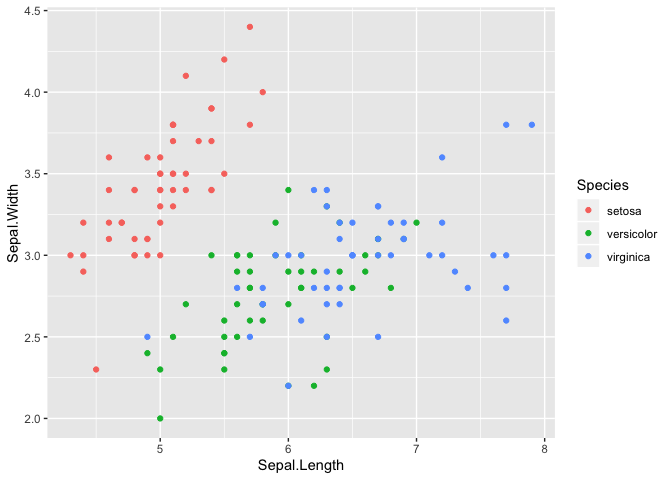
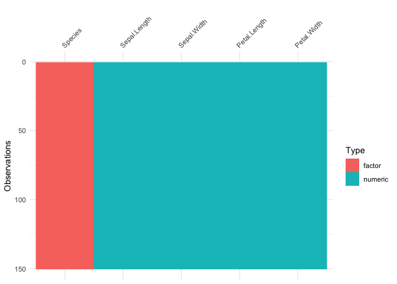
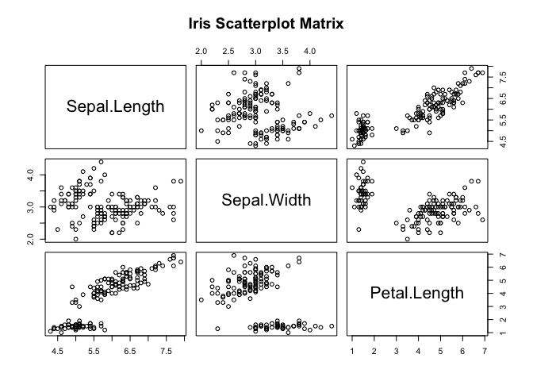
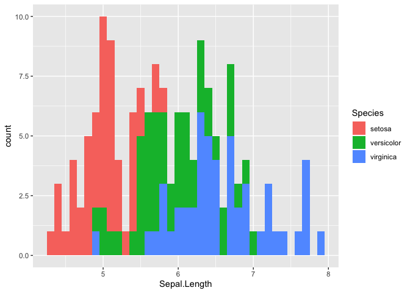
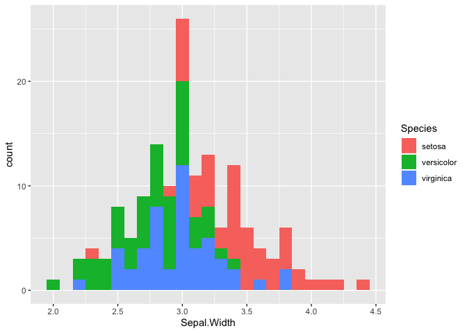
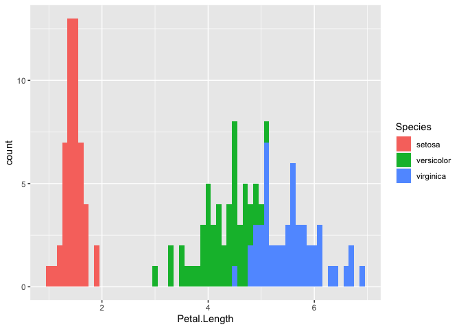
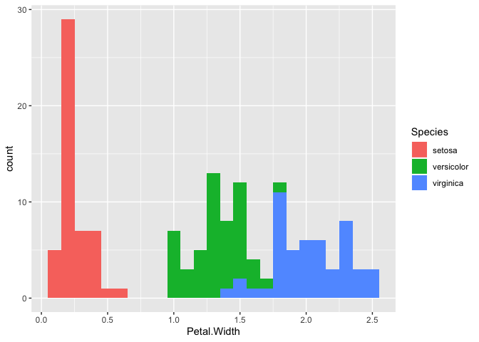

Iris Dataset analysis
================
Chan Mony Lach
29/01/2020

## The beginning

Hello World\!

I am far from being experienced in data science, therefore I figured I
should start with one of the most common datasets in the world; the
*IRIS* dataset.

This dataset is was commonly referred to in throughout my university
courses as a means to introduce various machine learning/statistical
concepts.

Fortunately this dataset is already built into R, which makes it a
suitable candidate for a beginner Exploratory Data Analysis (EDA).

The dataset describes three classes of flowers:

  - Setosa
  - Versicolor
  - Virginica

As well as their sepal length/width and petal length/width.

The first line of code will assign the iris dataset to an object called
“iris\_data”. This will allow for more functions to be applied to the
object at a later stage of this EDA.

The head() function will display the first 5 rows of the dataset.

The dim() function wil describe the dimensions of the iris dataset (or
“iris\_data” object). The function shows that there are 150 rows of
data with 5 headings.

``` r
iris_data <- iris
head(iris_data)
```

    ##   Sepal.Length Sepal.Width Petal.Length Petal.Width Species
    ## 1          5.1         3.5          1.4         0.2  setosa
    ## 2          4.9         3.0          1.4         0.2  setosa
    ## 3          4.7         3.2          1.3         0.2  setosa
    ## 4          4.6         3.1          1.5         0.2  setosa
    ## 5          5.0         3.6          1.4         0.2  setosa
    ## 6          5.4         3.9          1.7         0.4  setosa

``` r
dim(iris_data)
```

    ## [1] 150   5

By referring to the previous head() function, we can see that the 5
headings are: \* Sepal.Length \* Sepal.Width \* Petal.Length \*
Petal.Width \* Species

The summary() function allows us to see summary statistics of the
dataset.

``` r
summary(iris_data)
```

    ##   Sepal.Length    Sepal.Width     Petal.Length    Petal.Width   
    ##  Min.   :4.300   Min.   :2.000   Min.   :1.000   Min.   :0.100  
    ##  1st Qu.:5.100   1st Qu.:2.800   1st Qu.:1.600   1st Qu.:0.300  
    ##  Median :5.800   Median :3.000   Median :4.350   Median :1.300  
    ##  Mean   :5.843   Mean   :3.057   Mean   :3.758   Mean   :1.199  
    ##  3rd Qu.:6.400   3rd Qu.:3.300   3rd Qu.:5.100   3rd Qu.:1.800  
    ##  Max.   :7.900   Max.   :4.400   Max.   :6.900   Max.   :2.500  
    ##        Species  
    ##  setosa    :50  
    ##  versicolor:50  
    ##  virginica :50  
    ##                 
    ##                 
    ## 

Interestingly enough, it also shows the unique values of each flower,
and their occurences in the dataset which is seeen in the “species”
column.

A useful function to see the *type* of data in the dataset is sapply().
e.g. sapply(data, typeof)

``` r
sapply(iris_data, typeof)
```

    ## Sepal.Length  Sepal.Width Petal.Length  Petal.Width      Species 
    ##     "double"     "double"     "double"     "double"    "integer"

This shows that all the data in this dataset are of type *double*, with
the exception of species which is *integer*.

My understanding is that in the *real world*, datasets are not always
going to be clean, and some entries may have null values. The *is.null*
function can be used to check if the object contains null values.

If the output is *TRUE*, then our dataset does contain NULL values, and
therefore we can either choose to omit them from our analysis or do
something else. However, if the output is *FALSE*, then our dataset
*DOES NOT* contain null values (which is a good thing\!).

``` r
is.null(iris_data)
```

    ## [1] FALSE

There is also the skim function, found in the *skimr package* that will
scan your entire dataset and summarise, check for null values and more\!

``` r
#install.packages("skimr)
library(skimr)
skim(iris_data)
```

|                                                  |            |
| :----------------------------------------------- | :--------- |
| Name                                             | iris\_data |
| Number of rows                                   | 150        |
| Number of columns                                | 5          |
| \_\_\_\_\_\_\_\_\_\_\_\_\_\_\_\_\_\_\_\_\_\_\_   |            |
| Column type frequency:                           |            |
| factor                                           | 1          |
| numeric                                          | 4          |
| \_\_\_\_\_\_\_\_\_\_\_\_\_\_\_\_\_\_\_\_\_\_\_\_ |            |
| Group variables                                  | None       |

Data summary

**Variable type:
factor**

| skim\_variable | n\_missing | complete\_rate | ordered | n\_unique | top\_counts               |
| :------------- | ---------: | -------------: | :------ | --------: | :------------------------ |
| Species        |          0 |              1 | FALSE   |         3 | set: 50, ver: 50, vir: 50 |

**Variable type:
numeric**

| skim\_variable | n\_missing | complete\_rate | mean |   sd |  p0 | p25 |  p50 | p75 | p100 | hist  |
| :------------- | ---------: | -------------: | ---: | ---: | --: | --: | ---: | --: | ---: | :---- |
| Sepal.Length   |          0 |              1 | 5.84 | 0.83 | 4.3 | 5.1 | 5.80 | 6.4 |  7.9 | ▆▇▇▅▂ |
| Sepal.Width    |          0 |              1 | 3.06 | 0.44 | 2.0 | 2.8 | 3.00 | 3.3 |  4.4 | ▁▆▇▂▁ |
| Petal.Length   |          0 |              1 | 3.76 | 1.77 | 1.0 | 1.6 | 4.35 | 5.1 |  6.9 | ▇▁▆▇▂ |
| Petal.Width    |          0 |              1 | 1.20 | 0.76 | 0.1 | 0.3 | 1.30 | 1.8 |  2.5 | ▇▁▇▅▃ |

Suggested by Indrajeet Patil, who also created ggstatsplot2, you can
visualise your dataset as well as display missing data by using the
vis\_miss() function, and vis\_dat() function by utilizing the visdat
library.

``` r
#install.packages("devtools")
library(devtools)
#devtools::install_github("ropensci/visdat")
library(visdat)
vis_miss(iris_data)
```

<!-- -->
This output shows that there are no missing entries in the dataset. This
visualisation should look a little different as we explore more
unstructured/semi-structured
datasets.

``` r
vis_dat(iris_data)
```

<!-- -->

This vis\_dat output shows you a ggplot object of what is inside the
dataframe. Cells are colored according to what class they are and
whether the values are missing. Being a ggplot object, you can customise
the plot and/or change the labels if needed.

## Conclusion

There is no missing data, or NULL entries in this dataset as shown in
the methods utilized above.

Now that we’ve checked to make sure that the dataset is cleaned and
ready to use, lets do some visualisations.

Scatterplots are a great way to determine if there is a linear
correlation between different variables in your dataset.

By using the pairs() function from the ggplot package, we are able to
create a scatterplot matrix.

``` r
#install.packages("ggplot2")
#library(ggplot2)
pairs(~Sepal.Length+Sepal.Width+Petal.Length+Sepal.Width,data=iris_data, main="Iris Scatterplot Matrix")
```

<!-- -->
\#\# Conclusion The scatterplot matrix shows that the Sepal Length and
Petal Length are highly correlated. In other words, if the Sepal Length
of the flower is long, the petal length is expected to be long as well
and vice versa.

``` r
library(ggplot2)
ggplot(iris_data, aes(x=Sepal.Length, fill=Species)) + geom_histogram(binwidth = 0.1)
```

<!-- -->

This histogram shows the Sepal length of all the different species of
flowers in the dataset. The different colors represent the different
species. This makes it easier to identify the differences in length
between the different species. Using the Sepal length as a feature, we
have an easier time identifying a Setosa flower, as it has the shortest
average length. However, it is more difficult to identify a Versicolor
and/or Virginica Flower as the lengths are not easily
distinguished.

### 2D Scatterplot for Sepal Length and Sepal Width

``` r
qplot(Sepal.Length, Sepal.Width, data=iris_data, colour = Species)
```

<!-- -->

  - Setosa points (RED) can be distinguished from other species by using
    sepal length and sepal width as features.

  - Versicolor (GREEN) and Virginica (BLUE) cannot be easily
    distinguished as there is considerable overlap between the points.

<!-- end list -->

``` r
#Histogram v Scatterplot
#install.packages("cowplot")
library(cowplot)
scatter_sep<- ggplot2::qplot(Sepal.Length, Sepal.Width, data=iris_data, colour = Species)
hist_sep <- ggplot2::ggplot(iris, aes(x=Sepal.Length, fill=Species)) + geom_histogram(binwidth = 0.1)
p <- plot_grid(scatter_sep, hist_sep)
save_plot("sepal scat v hist.png", p, ncol = 2)
```


### 2D Scatterplot for Petal Length and Petal Width

``` r
library(cowplot)
scatter_pet<- ggplot2::qplot(Petal.Length, Petal.Width, data=iris_data, colour = Species)
hist_pet <- ggplot2::ggplot(iris, aes(x=Petal.Length, fill=Species)) + geom_histogram(binwidth = 0.1)
p <- plot_grid(scatter_pet, hist_pet)
save_plot("petal scat v hist.png", p, ncol = 2)
```

  - Setosa flower is easily distinguished as their is no overlap between
    the other species.

  - Versicolor and Virginica flowers are more easily distinguished as
    there is significantly less overlap.

  - Compared to the sepal plot, this petal plot is more effective at
    distinguishing the different flower species.

## Conclusion

Using different plots can help to visualise your data much more
effectively. This is shown above, as the histogram is much more
horizontally clustered and there is visual overlap, which may hide
important data points. By utilizing the scatterplot and the different
features (Sepal Length v Sepal Width, Petal Length v Petal Width), the
different species can be easily distinguished.

``` r
library(ggplot2)
ggplot(iris_data, aes(x=Sepal.Width, fill=Species)) + geom_histogram(binwidth = 0.1)
```

<!-- -->

This histogram shows that there isn’t much difference in sepal width
between Virginica and Versicolor flowers, however Setosa flowers tend to
have the highest width.

``` r
library(ggplot2)
ggplot(iris_data, aes(x=Petal.Length, fill=Species)) + geom_histogram(binwidth = 0.1)
```

<!-- -->

There is a clear distinction between petal lengths of the three
different flower species. Setosa has the lowest petal length, with
versicolor sitting in the middle, and Virginica having the highest.

``` r
library(ggplot2)
ggplot(iris_data, aes(x=Petal.Width, fill=Species)) + geom_histogram(binwidth = 0.1)
```

<!-- -->

Once again, Setosa appears to have the lowest petal length, versicolor
in the middle, and Virginica with the highest petal length.

Although this all seems very obvious initially, we are able to draw
insights from this data. For example, the Setosa flower has the smallest
sepal Length, petal width and petal length. Without an image as
reference, and no prior knowledge about flowers, this data helps us to
create an image where the Setosa flower species has small petals but a
wide sepal.

 Based on
previous predictions using the data from the histogram. It appears that
we are correct. The petals appear to be very small, and the sepals
appear to be somewhat short compared to the Virginica vlower and the
Versicolor flower, but the sepals are the widest. This image backs up
our prediction based on the visualised data.

References:

  - \[Flower image reference:
    <https://annhubhelp.anscenter.com/lib/NewItem167.png>\]
  - <https://www.r-bloggers.com/scatterplot-matrices/>
  - <https://www.littlemissdata.com/blog/simple-eda>
  - <https://medium.com/@rishav.jnit/exploratory-data-analysis-eda-on-iris-dataset-using-python-cadd850c1fc6>
