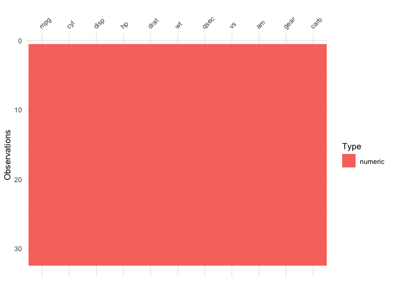

MT Cars Analysis
================
Chan Mony Lach
05/02/2020

``` r
library(ggplot2) #mtcars dataset part of ggplot2 package and visualisation
library(skimr) #to skim dataset
library(visdat)
```

This will be the second installment of my portfolio. In this markdown
document, I’ll be analysing the mtcars dataset.

> The mtcars data was extracted from the 1974 Motor Trend US magazine.
> It compares the fuel consumption and performance of thirty-two
> different automobiles based on ten different aspects of their design.

A snippet of this dataset is shown
    below:

``` r
head(mtcars)
```

    ##                    mpg cyl disp  hp drat    wt  qsec vs am gear carb
    ## Mazda RX4         21.0   6  160 110 3.90 2.620 16.46  0  1    4    4
    ## Mazda RX4 Wag     21.0   6  160 110 3.90 2.875 17.02  0  1    4    4
    ## Datsun 710        22.8   4  108  93 3.85 2.320 18.61  1  1    4    1
    ## Hornet 4 Drive    21.4   6  258 110 3.08 3.215 19.44  1  0    3    1
    ## Hornet Sportabout 18.7   8  360 175 3.15 3.440 17.02  0  0    3    2
    ## Valiant           18.1   6  225 105 2.76 3.460 20.22  1  0    3    1

Exploring the `?mtcars` function, I’m able to understand what each
variable means.

  - mpg: Miles/(US) gallon
  - cyl: Number of Cylinders
  - disp: Displacement (cu.in.)
  - hp: Gross Horsepower
  - drat Rear axle ratio
  - wt: Weight (1000lbs)
  - qsec 1/4 mile time
  - vs: Engine(0 = V-Shape, 1 = Straight)
  - am: Transmission(0 = automattic, 1 = manual)
  - gear: number of forward gears
  - carb: Number of carburetors

To get a better understanding of the dataset, the `skim()` function will
be used.

``` r
skim(mtcars)
```

|                                                  |        |
| :----------------------------------------------- | :----- |
| Name                                             | mtcars |
| Number of rows                                   | 32     |
| Number of columns                                | 11     |
| \_\_\_\_\_\_\_\_\_\_\_\_\_\_\_\_\_\_\_\_\_\_\_   |        |
| Column type frequency:                           |        |
| numeric                                          | 11     |
| \_\_\_\_\_\_\_\_\_\_\_\_\_\_\_\_\_\_\_\_\_\_\_\_ |        |
| Group variables                                  | None   |

Data summary

**Variable type:
numeric**

| skim\_variable    |    n\_missing |     complete\_rate |       mean |       sd |      p0 |      p25 |       p50 |       p75 |      p100 | hist                                                                                                                                                                                 |
| :---------------- | ------------: | -----------------: | ---------: | -------: | ------: | -------: | --------: | --------: | --------: | :----------------------------------------------------------------------------------------------------------------------------------------------------------------------------------- |
| mpg               |             0 |                  1 |      20.09 |     6.03 |   10.40 |    15.43 |     19.20 |     22.80 |     33.90 | ▃▇▅▁▂                                                                                                                                                                                |
| cyl               |             0 |                  1 |       6.19 |     1.79 |    4.00 |     4.00 |      6.00 |      8.00 |      8.00 | ▆▁▃▁▇                                                                                                                                                                                |
| disp              |             0 |                  1 |     230.72 |   123.94 |   71.10 |   120.83 |    196.30 |    326.00 |    472.00 | ▇▃▃▃▂                                                                                                                                                                                |
| hp                |             0 |                  1 |     146.69 |    68.56 |   52.00 |    96.50 |    123.00 |    180.00 |    335.00 | ▇▇▆▃▁                                                                                                                                                                                |
| drat              |             0 |                  1 |       3.60 |     0.53 |    2.76 |     3.08 |      3.70 |      3.92 |      4.93 | ▇▃▇▅▁                                                                                                                                                                                |
| wt                |             0 |                  1 |       3.22 |     0.98 |    1.51 |     2.58 |      3.33 |      3.61 |      5.42 | ▃▃▇▁▂                                                                                                                                                                                |
| qsec              |             0 |                  1 |      17.85 |     1.79 |   14.50 |    16.89 |     17.71 |     18.90 |     22.90 | ▃▇▇▂▁                                                                                                                                                                                |
| vs                |             0 |                  1 |       0.44 |     0.50 |    0.00 |     0.00 |      0.00 |      1.00 |      1.00 | ▇▁▁▁▆                                                                                                                                                                                |
| am                |             0 |                  1 |       0.41 |     0.50 |    0.00 |     0.00 |      0.00 |      1.00 |      1.00 | ▇▁▁▁▆                                                                                                                                                                                |
| gear              |             0 |                  1 |       3.69 |     0.74 |    3.00 |     3.00 |      4.00 |      4.00 |      5.00 | ▇▁▆▁▂                                                                                                                                                                                |
| carb              |             0 |                  1 |       2.81 |     1.62 |    1.00 |     2.00 |      2.00 |      4.00 |      8.00 | ▇▂▅▁▁                                                                                                                                                                                |
| Under the \*Varia | ble type\* ta | ble, the \*n\_miss | ing\* colu | mn shows | a value | of 0 for | all varia | bles of t | his datas | et. This is good news as there is no missing data, and thus we can continue. However, this is to be expected, as this dataset was built into the immensly popular *ggplot2* package. |

To visualise the different datatypes within the mtcars dataset we’ll use
the `vis_dat()` function from the `visdat` package

``` r
vis_dat(mtcars)
```

<!-- -->
