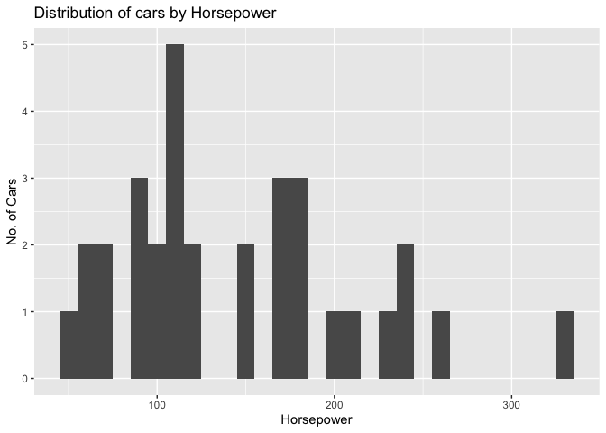
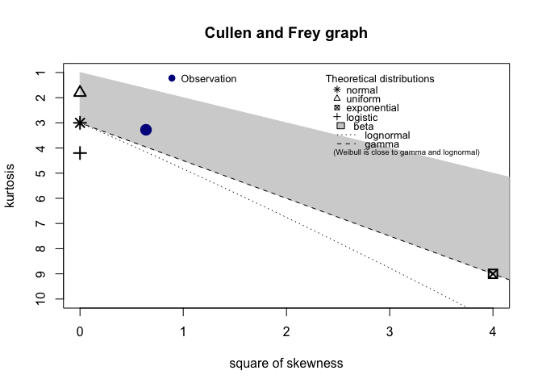
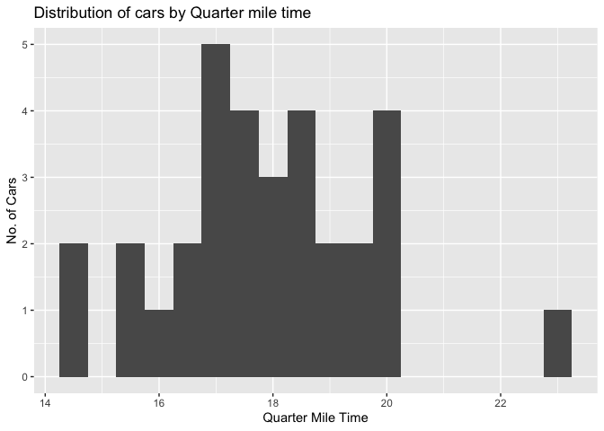
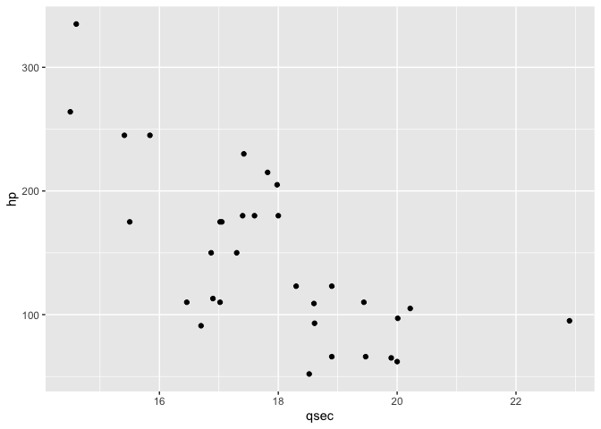
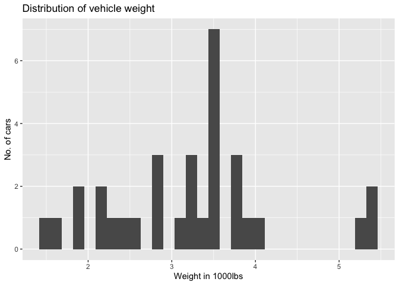
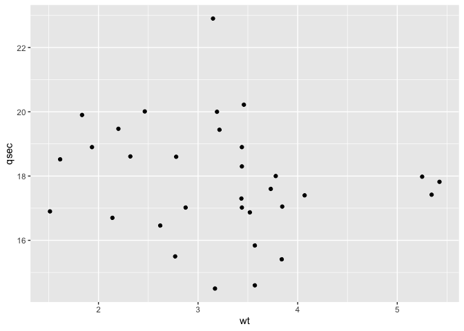

MT Cars Analysis
================
Chan Mony Lach
05/02/2020

``` r
library(ggplot2) #mtcars dataset part of ggplot2 package and visualisation
library(skimr) #to skim dataset
library(visdat)
library(MASS)
library(fitdistrplus)
library(logspline)
```

This will be the second installment of my portfolio. In this markdown
document, I’ll be analysing the mtcars dataset.

> The mtcars data was extracted from the 1974 Motor Trend US magazine.
> It compares the fuel consumption and performance of thirty-two
> different automobiles based on ten different aspects of their design.

A snippet of this dataset is shown
    below:

``` r
head(mtcars)
```

    ##                    mpg cyl disp  hp drat    wt  qsec vs am gear carb
    ## Mazda RX4         21.0   6  160 110 3.90 2.620 16.46  0  1    4    4
    ## Mazda RX4 Wag     21.0   6  160 110 3.90 2.875 17.02  0  1    4    4
    ## Datsun 710        22.8   4  108  93 3.85 2.320 18.61  1  1    4    1
    ## Hornet 4 Drive    21.4   6  258 110 3.08 3.215 19.44  1  0    3    1
    ## Hornet Sportabout 18.7   8  360 175 3.15 3.440 17.02  0  0    3    2
    ## Valiant           18.1   6  225 105 2.76 3.460 20.22  1  0    3    1

Exploring the `?mtcars` function, I’m able to understand what each
variable means.

  - mpg: Miles/(US) gallon
  - cyl: Number of Cylinders
  - disp: Displacement (cu.in.)
  - hp: Gross Horsepower
  - drat Rear axle ratio
  - wt: Weight (1000lbs)
  - qsec 1/4 mile time
  - vs: Engine(0 = V-Shape, 1 = Straight)
  - am: Transmission(0 = automatic, 1 = manual)
  - gear: number of forward gears
  - carb: Number of carburetors

To get a better understanding of the dataset, the `skim()` function will
be used.

``` r
skim(mtcars)
```

|                                                  |        |
| :----------------------------------------------- | :----- |
| Name                                             | mtcars |
| Number of rows                                   | 32     |
| Number of columns                                | 11     |
| \_\_\_\_\_\_\_\_\_\_\_\_\_\_\_\_\_\_\_\_\_\_\_   |        |
| Column type frequency:                           |        |
| numeric                                          | 11     |
| \_\_\_\_\_\_\_\_\_\_\_\_\_\_\_\_\_\_\_\_\_\_\_\_ |        |
| Group variables                                  | None   |

Data summary

**Variable type:
numeric**

| skim\_variable    |    n\_missing |     complete\_rate |       mean |       sd |      p0 |      p25 |       p50 |       p75 |      p100 | hist                                                                                                                                                                                 |
| :---------------- | ------------: | -----------------: | ---------: | -------: | ------: | -------: | --------: | --------: | --------: | :----------------------------------------------------------------------------------------------------------------------------------------------------------------------------------- |
| mpg               |             0 |                  1 |      20.09 |     6.03 |   10.40 |    15.43 |     19.20 |     22.80 |     33.90 | ▃▇▅▁▂                                                                                                                                                                                |
| cyl               |             0 |                  1 |       6.19 |     1.79 |    4.00 |     4.00 |      6.00 |      8.00 |      8.00 | ▆▁▃▁▇                                                                                                                                                                                |
| disp              |             0 |                  1 |     230.72 |   123.94 |   71.10 |   120.83 |    196.30 |    326.00 |    472.00 | ▇▃▃▃▂                                                                                                                                                                                |
| hp                |             0 |                  1 |     146.69 |    68.56 |   52.00 |    96.50 |    123.00 |    180.00 |    335.00 | ▇▇▆▃▁                                                                                                                                                                                |
| drat              |             0 |                  1 |       3.60 |     0.53 |    2.76 |     3.08 |      3.70 |      3.92 |      4.93 | ▇▃▇▅▁                                                                                                                                                                                |
| wt                |             0 |                  1 |       3.22 |     0.98 |    1.51 |     2.58 |      3.33 |      3.61 |      5.42 | ▃▃▇▁▂                                                                                                                                                                                |
| qsec              |             0 |                  1 |      17.85 |     1.79 |   14.50 |    16.89 |     17.71 |     18.90 |     22.90 | ▃▇▇▂▁                                                                                                                                                                                |
| vs                |             0 |                  1 |       0.44 |     0.50 |    0.00 |     0.00 |      0.00 |      1.00 |      1.00 | ▇▁▁▁▆                                                                                                                                                                                |
| am                |             0 |                  1 |       0.41 |     0.50 |    0.00 |     0.00 |      0.00 |      1.00 |      1.00 | ▇▁▁▁▆                                                                                                                                                                                |
| gear              |             0 |                  1 |       3.69 |     0.74 |    3.00 |     3.00 |      4.00 |      4.00 |      5.00 | ▇▁▆▁▂                                                                                                                                                                                |
| carb              |             0 |                  1 |       2.81 |     1.62 |    1.00 |     2.00 |      2.00 |      4.00 |      8.00 | ▇▂▅▁▁                                                                                                                                                                                |
| Under the \*Varia | ble type\* ta | ble, the \*n\_miss | ing\* colu | mn shows | a value | of 0 for | all varia | bles of t | his datas | et. This is good news as there is no missing data, and thus we can continue. However, this is to be expected, as this dataset was built into the immensly popular *ggplot2* package. |

We also have 11 variables, which were listed previously.

To visualise the different datatypes within the mtcars dataset we’ll use
the `vis_dat()` function from the `visdat` package

``` r
vis_dat(mtcars)
```

<!-- --> This plot
shows us that all the values in the dataset are of type numeric. \#\#\#
Summary Statistics:

``` r
summary(mtcars)
```

    ##       mpg             cyl             disp             hp       
    ##  Min.   :10.40   Min.   :4.000   Min.   : 71.1   Min.   : 52.0  
    ##  1st Qu.:15.43   1st Qu.:4.000   1st Qu.:120.8   1st Qu.: 96.5  
    ##  Median :19.20   Median :6.000   Median :196.3   Median :123.0  
    ##  Mean   :20.09   Mean   :6.188   Mean   :230.7   Mean   :146.7  
    ##  3rd Qu.:22.80   3rd Qu.:8.000   3rd Qu.:326.0   3rd Qu.:180.0  
    ##  Max.   :33.90   Max.   :8.000   Max.   :472.0   Max.   :335.0  
    ##       drat             wt             qsec             vs        
    ##  Min.   :2.760   Min.   :1.513   Min.   :14.50   Min.   :0.0000  
    ##  1st Qu.:3.080   1st Qu.:2.581   1st Qu.:16.89   1st Qu.:0.0000  
    ##  Median :3.695   Median :3.325   Median :17.71   Median :0.0000  
    ##  Mean   :3.597   Mean   :3.217   Mean   :17.85   Mean   :0.4375  
    ##  3rd Qu.:3.920   3rd Qu.:3.610   3rd Qu.:18.90   3rd Qu.:1.0000  
    ##  Max.   :4.930   Max.   :5.424   Max.   :22.90   Max.   :1.0000  
    ##        am              gear            carb      
    ##  Min.   :0.0000   Min.   :3.000   Min.   :1.000  
    ##  1st Qu.:0.0000   1st Qu.:3.000   1st Qu.:2.000  
    ##  Median :0.0000   Median :4.000   Median :2.000  
    ##  Mean   :0.4062   Mean   :3.688   Mean   :2.812  
    ##  3rd Qu.:1.0000   3rd Qu.:4.000   3rd Qu.:4.000  
    ##  Max.   :1.0000   Max.   :5.000   Max.   :8.000

## The Question

With all this information in hand, I would like to find out if **more
horsepower results in a lower 1/4 mile time. **

To begin, the distribution of the required data should be visualised to
get a feel for
it.

### Distribution of cars by Horsepower

``` r
ggplot(mtcars, aes(hp)) + geom_histogram(binwidth = 10 )+ xlab('Horsepower') + ylab('No. of Cars') + ggtitle('Distribution of cars by Horsepower')
```

<!-- -->

Though this looks like a right-skewed normal Gaussian distribution, I’ll
run some tests to see if there are any other candidates.

``` r
descdist(mtcars$hp, discrete=FALSE)
```

<!-- -->

    ## summary statistics
    ## ------
    ## min:  52   max:  335 
    ## median:  123 
    ## mean:  146.6875 
    ## estimated sd:  68.56287 
    ## estimated skewness:  0.7994067 
    ## estimated kurtosis:  3.275212

The kurtosis and squared skewness of the horsepower data appear as a
blue bubble named “Observation”. It appears that the closest
distribution is the **Beta** distribution.

This Shapiro-Wilk normality test also supports this statement:

``` r
shapiro.test(mtcars$hp)
```

    ## 
    ##  Shapiro-Wilk normality test
    ## 
    ## data:  mtcars$hp
    ## W = 0.93342, p-value = 0.04881

As the p-value is under 0.05, we have enough evidence to reject the null
hypothesis that the data is fits a right-skewed normal
distribution.

### Distribution of cars by Quarter mile time

``` r
ggplot(mtcars, aes(qsec)) + geom_histogram(binwidth = 0.5)+ xlab('Quarter Mile Time') + ylab('No. of Cars') + ggtitle('Distribution of cars by Quarter mile time')
```

<!-- -->

This data appears to follow a Gaussian distribution.

However, we’ll perform a Shapiro-Wilk Normality test to see if this is
true.

``` r
shapiro.test(mtcars$qsec)
```

    ## 
    ##  Shapiro-Wilk normality test
    ## 
    ## data:  mtcars$qsec
    ## W = 0.97325, p-value = 0.5935

With such a high p-value, we do not have enough evidence to reject the
null hypothesis (distribution is Normal/Gaussian), therefore we cannot
rule out that possibility.

## Correlation between Quarter mile time and Horsepower.

``` r
cor(mtcars$qsec, mtcars$hp)
```

    ## [1] -0.7082234

This shows a strong negative correlation.

\#\#Plotting the data

``` r
qplot(qsec, hp, data=mtcars)
```

<!-- -->

This plot also shows a negative correlation with Horsepower and Quarter
mile time. It appears that the more horsepower the car has, less time it
takes in a quarter mile. Intuitively this makes sense. The more power a
vehicle can produce, the quicker it goes. However, there are exceptions
to this. What about heavier vehicles? Would their weight be compensated
by extra
horsepower?

## Visualising weight

``` r
qplot(mtcars$wt, geom = "histogram", xlab = "Weight in 1000lbs", ylab = "No. of cars", main = "Distribution of vehicle weight")
```

<!-- --> The vehicles
appear to be around the 3000lbs - 4000lbs range. Next we’ll check to see
the relationship between weight and 1/4 mile times.

``` r
qplot(wt, qsec, data=mtcars)
```

<!-- -->

This plot is a little difficult to interpret whether there is any
correlation at all between the two variables. Therefore a Pearson R
Correlation test will be performed to check for correlation. A Pearson
correlation test will check if there is a statistically significant
relationship between both weight (wt) and 1/4 mile time (qsec).

``` r
cor.test(mtcars$wt, mtcars$qsec, method = "pearson")
```

    ## 
    ##  Pearson's product-moment correlation
    ## 
    ## data:  mtcars$wt and mtcars$qsec
    ## t = -0.97191, df = 30, p-value = 0.3389
    ## alternative hypothesis: true correlation is not equal to 0
    ## 95 percent confidence interval:
    ##  -0.4933536  0.1852649
    ## sample estimates:
    ##        cor 
    ## -0.1747159

### Interpretation

  - `t` is the t-test statistic value `(t = -0.97191)`,
  - `df` is the degrees of freedom `(df = 30)`,
  - `p-value` is the significance level of the t-test `(p-value
    = 0.3389)`,
  - `conf-int` is the confidence interval of the correlation coefficient
    at 95% \`(conf.int = \[-0.4933536, 0.1852649\]),
  - `sample estimates` is the correlation co-effcient `cor =
    -0.1747159`.
